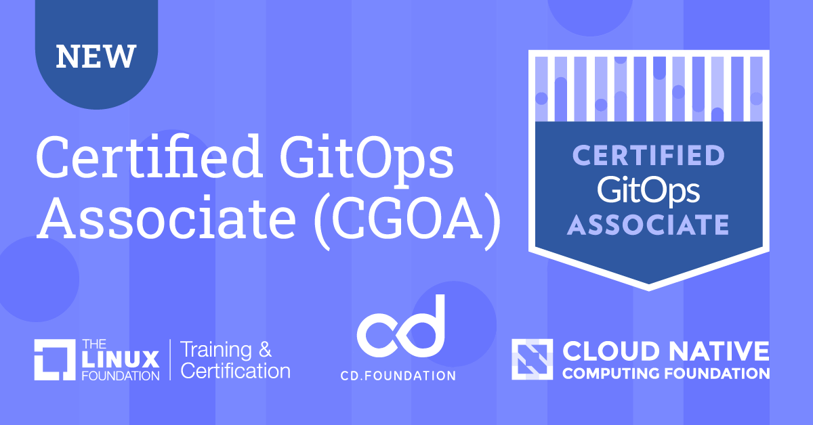

# Certified GitOps Associate (CGOA) Study Guide

## Disclaimer

*This study guide is an **unofficial resource** created to assist candidates preparing for the Certified GitOps Associate (CGOA) exam. Originally compiled during the beta due to the limited availability of dedicated materials for the CGOA, as such it has not been endorsed by the Linux Foundation or any other official body associated with the CGOA certification.*

## Introduction

The Certified GitOps Associate (CGOA) is a certification offered by the [Linux Foundation](https://www.linuxfoundation.org/). More information about the certification can be found on the [official exam page](https://training.linuxfoundation.org/certification/certified-gitops-associate-cgoa/).

## Table of Contents

- [Certified GitOps Associate (CGOA) Study Guide](#certified-gitops-associate-cgoa-study-guide)
  - [Disclaimer](#disclaimer)
  - [Introduction](#introduction)
  - [Table of Contents](#table-of-contents)
  - [Background](#background)
  - [Domains & Competencies](#domains--competencies)
    - **[GitOps Terminology - 20%](#gitops-terminology---20)**
      - [Continuous](#continuous)
      - [Declarative Description](#declarative-description)
      - [Desired State](#desired-state)
      - [State Drift](#state-drift)
      - [State Reconciliation](#state-reconciliation)
      - [GitOps Managed Software System](#gitops-managed-software-system)
      - [State Store](#state-store)
      - [Feedback Loop](#feedback-loop)
      - [Rollback](#rollback)
    - **[GitOps Principles - 30%](#gitops-principles---30)**
      - [Declarative](#declarative)
      - [Versioned and Immutable](#versioned-and-immutable)
      - [Pulled Automatically](#pulled-automatically)
      - [Continuously Reconciled](#continuously-reconciled)
    - **[Related Practices - 16%](#related-practices---16)**
      - [Configuration as Code (CaC)](#configuration-as-code-cac)
      - [Infrastructure as Code (IaC)](#infrastructure-as-code-iac)
      - [DevOps and DevSecOps](#devops-and-devsecops)
      - [CI and CD](#ci-and-cd)
    - **[GitOps Patterns - 20%](#gitops-patterns---20)**
      - [Deployment and Release Patterns](#deployment-and-release-patterns)
      - [Progressive Delivery Patterns](#progressive-delivery-patterns)
      - [Pull vs. Event-driven](#pull-vs-event-driven)
      - [Architecture Patterns (in-cluster and external reconciler, state store management, etc.)](#architecture-patterns-in-cluster-and-external-reconciler-state-store-management-etc)
    - **[Tooling - 14%](#tooling---14)**
      - [Manifest Format and Packaging](#manifest-format-and-packaging)
      - [State Store Systems (Git and alternatives)](#state-store-systems-git-and-alternatives)
      - [Reconciliation Engines (ArgoCD, Flux, and alternatives)](#reconciliation-engines-argocd-flux-and-alternatives)
      - [Interoperability with Notifications, Observability, and Continuous Integration Tools](#interoperability-with-notifications-observability-and-continuous-integration-tools)
  - [Additional Resources](#additional-resources)

## Background

Resources:

- [Introduction to DevOps and Site Reliability Engineering (LFS162)](https://training.linuxfoundation.org/training/introduction-to-devops-and-site-reliability-engineering-lfs162/) - Training Course (Free)
- [Introduction to GitOps (LFS169)](https://training.linuxfoundation.org/training/introduction-to-gitops-lfs169/) - Training Course (Free)

## Domains & Competencies

### GitOps Terminology - 20%

#### Continuous

> Continuous is intended to match the industry standard term: [reconciliation](#state-reconciliation) continues to happen, not that it must be instantaneous.

#### Declarative Description

> A configuration that describes the desired operating state of a system without specifying procedures for how that state will be achieved. This separates configuration (the desired state) from the implementation (commands, API calls, scripts etc.) used to achieve that state.

#### Desired State

> The aggregate of all configuration data that is sufficient to recreate the system so that instances of the system are behaviourally indistinguishable. This configuration data generally does not include persistent application data, e.g., database contents, though often does include credentials for accessing that data, or configuration for data recovery tools running on that system.

#### State Drift

> When a system's actual state has moved or is in the process of moving away from the [desired state](#desired-state), this is often referred to as drift.

Resources:

- [You Aren't Doing GitOps Without Drift Detection](https://www.weave.works/blog/you-aren-t-doing-gitops-without-drift-detection) - Article

#### State Reconciliation

> The process of ensuring the actual state of a system matches its [desired state](#desired-state). Contrary to traditional CI/CD where automation is generally driven by pre-set triggers, in GitOps reconciliation is triggered whenever there is a divergence. Divergence could be due to the actual state unintentionally [drifting](#state-drift) from the desired state declarations, or a new desired state declaration version having been changed intentionally. Actions are taken based on policies around [feedback](#feedback-loop) from the system and previous reconciliation attempts, in order to reduce deviation over time.

#### GitOps Managed Software System

> A software system managed by GitOps includes:
>
> 1. One or more runtime environments consisting of resources under management.
> 2. The management agents within each runtime.
> 3. Policies for controlling access and management of repositories, deployments, runtimes.

#### State Store

> A system for storing immutable versions of [desired state](#desired-state) declarations. This state store should provide access control and auditing on the changes to the Desired State. Git, from which GitOps derives its name, is the canonical example used as this state store but any other system that meets these criteria may be used. In all cases, these state stores must be properly configured and precautions must be taken to comply with requirements set out in the GitOps Principles.

- **State Store = Single Source of Truth**

#### Feedback Loop

> Open GitOps follows [control-theory](https://en.wikipedia.org/wiki/Control_theory) and operates in a closed-loop. In control theory, feedback represents how previous attempts to apply a desired state have affected the actual state. For example, if the desired state requires more resources than exist in a system, the software agent may make attempts to add resources, to automatically rollback to a previous version, or to send alerts to human operators.

#### Rollback

Rollback is the process of reverting a system to a previous state. In GitOps, the rollback process is often automated by changing the desired state to a previous version and allowing the reconciliation process to apply that state.

`git revert` is an example of a rollback operation in Git.

Resources:

- [Rolling Back a Deployment](https://kubernetes.io/docs/concepts/workloads/controllers/deployment/#rolling-back-a-deployment) - Kubernetes Docs

### GitOps Principles - 30%

Resources:

- [OpenGitOps Documents](https://github.com/open-gitops/documents) - OpenGitOps Docs
- [GitOps Principles](https://www.harness.io/blog/gitops-principles) - Article

> GitOps is a set of principles for operating and managing software systems. These principles are derived from modern software operations but are also rooted in pre-existing and widely adopted best practices.
>
> The [desired state](#desired-state) of a GitOps managed system must be:

#### Declarative

> A [system](#gitops-managed-software-system) managed by GitOps must have its desired state expressed [declaratively](#declarative-description).

#### Versioned and Immutable

> Desired state is [stored](state-store) in a way that enforces immutability, versioning and retains a complete version history.

#### Pulled Automatically

> Software agents automatically [pull](#pull-vs-event-driven) the desired state declarations from the source.

#### Continuously Reconciled

> Software agents [continuously](#continuous) observe actual system state and [attempt to apply](#state-reconciliation) the [desired state](#desired-state).

### Related Practices - 16%

#### Configuration as Code (CaC)

Configuration as Code (CaC) involves managing and provisioning infrastructure through machine-readable definition files, rather than physical hardware configuration or interactive configuration tools. This practice enables developers and IT operations teams to automatically manage and provision their infrastructure using code. CaC is a key component of GitOps, as it allows for the desired state of infrastructure to be described declaratively and managed alongside application code.

Resources:

- [Configuration as Code](https://circleci.com/blog/configuration-as-code/) - Article
- [Comparing Infrastructure as Code and GitOps for Platform Teams](https://thenewstack.io/comparing-infrastructure-as-code-and-gitops-for-platform-teams/) - Article

#### Infrastructure as Code (IaC)

Infrastructure as Code (IaC) is a key practice within DevOps that involves managing and provisioning computing infrastructure through code instead of through manual processes. With IaC, infrastructure is provisioned and managed using code and software development techniques, such as version control and continuous integration. IaC is foundational to GitOps, enabling the automatic, consistent deployment of infrastructure alongside applications.

Resources:

- [What is Infrastructure as Code?](https://www.hashicorp.com/resources/what-is-infrastructure-as-code) - Article
- [Getting Started with Infrastructure as Code](https://learn.hashicorp.com/tutorials/terraform/infrastructure-as-code) - Terraform Docs

#### DevOps and DevSecOps

- **DevOps** is a set of practices that combines software development (Dev) and IT operations (Ops) to shorten the development lifecycle and provide continuous delivery with high software quality. GitOps can be seen as an evolution of DevOps principles, focused on using Git as a single source of truth for declarative infrastructure and applications.
- **DevSecOps** extends DevOps by integrating security practices into the DevOps process, ensuring that security is built into the software development lifecycle. GitOps can be used to enforce security policies and best practices across the software development lifecycle.

Resources:

- [What is DevOps?](https://about.gitlab.com/topics/devops/) - Article
- [Introduction to DevSecOps](https://www.redhat.com/en/topics/devops/what-is-devsecops) - Article
- [Trusted Delivery with GitOps and Policy as Code](https://www.weave.works/blog/trusted-delivery-with-gitops-and-policy-as-code) - Article
- [What Is GitOps? How Git Can Make DevOps Even Better](https://codefresh.io/learn/gitops/) - Article

#### CI and CD

- **Continuous Integration (CI)**: The automated process of integrating code changes from multiple contributors into a shared repository. This process includes automated testing to validate code changes before they are merged, ensuring that the codebase remains stable and functional.
- **Continuous Delivery (CD)**: The practice of automating the software delivery process to ensure that code changes can be deployed to production at any time. GitOps can be used to automate the continuous delivery process, ensuring that the [desired state](#desired-state) of the system is always reflected in the production environment.

Resources:

- [What is Continuous Integration?](https://www.atlassian.com/continuous-delivery/continuous-integration) - Article
- [What is Continuous Delivery?](https://www.atlassian.com/continuous-delivery/principles/continuous-integration-vs-delivery-vs-deployment) - Article

### GitOps Patterns - 20%

#### Deployment and Release Patterns

- **Recreate**: This pattern involves tearing down the existing instances of an application before deploying the new version. While straightforward, the main drawback is the downtime between stopping the old version and starting the new version, making it less desirable for production environments that require high availability.
- **Rolling Updates**: Kubernetes supports rolling updates natively, allowing updates to be applied incrementally without taking the service down. This strategy updates pods one by one, ensuring that a certain number of old and new pods are running simultaneously, which minimizes downtime and ensures that at least part of the application remains available during the update.
- **Blue-Green**: Involves running two identical environments ("blue" for the current version and "green" for the new version) and switching traffic from blue to green once the new version is verified to be stable. This pattern is useful for minimizing downtime and risk during deployments.

Resources:

- [Top 6 Kubernetes Deployment Strategies and How to Choose](https://codefresh.io/learn/kubernetes-deployment/top-6-kubernetes-deployment-strategies-and-how-to-choose/) - Article
- [Blue-Green Deployment](https://www.redhat.com/en/topics/devops/what-is-blue-green-deployment) - Article

#### Progressive Delivery Patterns

- **Canary**: This involves rolling out the change to a small subset of users or servers first, monitoring the performance and stability, and then gradually increasing the rollout to more users.
- **Shadow**/Blue-Green Mirroring: This pattern involves deploying the new version alongside the old version in such a way that the new version processes real-world traffic in parallel without affecting the end-user experience, primarily for testing purposes.
- **A/B Testing**/Traffic Splitting: Similar to canary releases but focuses more on comparing user behavior between the old and new versions to make data-driven decisions on feature adoption.

Resources:

- [Guide to Flagger](https://www.weave.works/technologies/flagger/) - Weave Works Docs
- [Flux Progressive Delivery](https://fluxcd.io/flux/concepts/#progressive-delivery) - Flux Docs
- [Flagger Deployment Strategies](https://docs.flagger.app/usage/deployment-strategies) - Flagger Docs
- [What are Feature Flags?](https://launchdarkly.com/blog/what-are-feature-flags/) - Article
- [Argo Rollouts](https://argoproj.github.io/argo-rollouts/) - Argo Rollouts Docs

#### Pull vs. Event-driven

> [Principle 3](#pulled-automatically) specifies the desired state must be "pulled" rather than "pushed", primarily because the software agents must be able to access the [desired state](#desired-state) from the [state store](#state-store) at _any_ time, not only when there is an intentional change in the state store triggering a push event.
> This is a prerequisite for [reconciliation](#state-reconciliation) to happen [continuously](#continuous), as specified in [principle 4](#continuously-reconciled).
>
> Note that – in contrast to traditional CI/CD, where automation is generally driven by pre-set triggers – in GitOps, [reconciliation](#state-reconciliation) is triggered _whenever_ there is a divergence. Divergence could be due to the actual state unintentionally [drifting](#state-drift) from the desired state declarations – not only due to a new desired state declaration version having been changed intentionally.

- **Pull-Based**: Required for GitOps, agents within the cluster continuously monitor the Git repository for changes and apply updates automatically.

- **Event-Driven**: While not the primary model in GitOps, event-driven mechanisms can complement GitOps by triggering actions based on specific events.

Resources:

- [GitOps: The Push and Pull Approach](https://www.harness.io/blog/gitops-the-push-and-pull-approach) - Article
- [Understanding Pull-Based GitOps](https://www.weave.works/blog/gitops-operations-by-pull-request) - Article

#### Architecture Patterns (in-cluster and external reconciler, state store management, etc.)

- **In-Cluster Reconciler**: A software agent that runs within the cluster and is responsible for monitoring the state of the cluster and applying the desired state.
- **External Reconciler**: Similar to in-cluster reconcilers, but run outside the cluster, often used for multi-cluster management or for managing resources that are not directly accessible from within the cluster.
- **State Store Management**: Structuring and managing the state store to ensure immutability, versioning, and complete version history.
- **Secrets Management**: Managing secrets in a secure and compliant manner, often using tools like Vault, Sealed Secrets, or GitOps-specific solutions like KubeSecrets.

Resources:

- [Ways of structuring your repositories](https://fluxcd.io/flux/guides/repository-structure/) - Flux Docs
- [Managing the 'Git' in 'GitOps': 4 Ways to Structure Code in Your GitOps Repos](https://www.harness.io/blog/gitops-repo-structure) - Article
- [Argo CD Architectures Explained](https://akuity.io/blog/argo-cd-architectures-explained/) - Article
- [The Basics of GitOps Secrets Management](https://www.harness.io/blog/gitops-secrets) - Article
- [What is Multi-Cloud GitOps?](https://www.redhat.com/en/topics/devops/what-is-multicloud-gitops) - Article

### Tooling - 14%

#### Manifest Format and Packaging

- **Kustomize**: Offers a template-free way to customize application configuration that simplifies the declaration of application manifests for Kubernetes.
- **Helm**: Provides packaging of Kubernetes applications into charts, making it easy to share and distribute a wide range of applications.
- **Declaritive YAML/JSON**: A format for expressing the desired state of a system in a way that is both human-readable and machine-readable.

Resources:

- [Kustomize Documentation](https://kubectl.docs.kubernetes.io/guides/introduction/kustomize/) - Kustomize Docs
- [Putting Helm at the Center of Your GitOps Pipeline](https://www.weave.works/blog/putting-helm-at-gitops-pipeline) - Article

#### State Store Systems (Git and alternatives)

- **Git**: A distributed version control system that is widely used for source code management and is the canonical example of a state store used in GitOps.
- **OCI Registry**: A container registry that is used to store and distribute container images.
- **S3**: A scalable object storage service that is used to store and retrieve data.

Resources:

- [What is Git?](https://www.atlassian.com/git/tutorials/what-is-git) - Article
- [GitOps with OCI Artifacts and Config Sync](https://cloud.google.com/blog/products/containers-kubernetes/gitops-with-oci-artifacts-and-config-sync) - Article
- [GitOps Use Cases You May Not Have Considered](https://thenewstack.io/gitops-use-cases-you-may-not-have-considered/) - Article
- [Flux with Buckets: Is this still GitOps?](https://blog.ediri.io/flux-with-buckets-is-this-still-gitops) - Article
- [Single Source of Truth Architecture](https://www.redhat.com/architect/single-source-truth-architecture) - Article

#### Reconciliation Engines (ArgoCD, Flux, and alternatives)

- **ArgoCD**: A declarative, GitOps continuous delivery tool for Kubernetes.
- **Flux**: A tool for keeping Kubernetes clusters in sync with sources of configuration (like Git repositories), and automating updates to configuration when there is new code to deploy.
- **Jenkins X**: An open-source system that provides pipeline automation, GitOps, and continuous delivery for cloud-native applications on Kubernetes.

Resources:

- [ArgoCD Documentation](https://argoproj.github.io/argo-cd/) - ArgoCD Docs
- [Flux Documentation](https://fluxcd.io/docs/) - Flux Docs
- [Jenkins X Documentation](https://jenkins-x.io/docs/) - Jenkins X Docs

#### Interoperability with Notifications, Observability, and Continuous Integration Tools

- **DORA Metrics**: A set of metrics that are used to measure the performance of software delivery and operational processes.
- **Keptn**: Integrates with Flux and ArgoCD to provide automated continuous delivery and operations for cloud-native applications.
- **Prometheus & Alertmanager**: Used for monitoring and alerting, providing a rich set of metrics and alerting capabilities.
- **Jenkins**: A popular open-source automation server used to automate the building, testing, and deployment of software.
- **Slack** & Microsoft Teams: Popular messaging platforms used for notifications and collaboration.

Resources:

- [Using the Four Keys to Measure Your DevOps Performance](https://cloud.google.com/blog/products/devops-sre/using-the-four-keys-to-measure-your-devops-performance) - Article
- [Keptn Core Concepts](https://keptn.sh/latest/docs/core-concepts/) - Keptn Docs
- [Flux Alerts](https://fluxcd.io/flux/monitoring/alerts/) - Flux Docs
- [Flux Prometheus metrics](https://fluxcd.io/flux/monitoring/metrics/) - Flux Docs
- [Prometheus Documentation](https://prometheus.io/docs/introduction/overview/) - Prometheus Docs
- [Jenkins Documentation](https://www.jenkins.io/doc/) - Jenkins Docs
- [Slack API Documentation](https://api.slack.com/) - Slack API Docs

## Additional Resources

- [Path to GitOps](https://developers.redhat.com/e-books/path-gitops) - eBook (Free)
- [GitOps Guide to the Galaxy](https://www.youtube.com/playlist?list=PLaR6Rq6Z4IqfGCkI28cUMbNhPhsnj4nq3) - YouTube Playlist
- [GitOps Cookbook](https://developers.redhat.com/e-books/gitops-cookbook) - eBook (Free)
